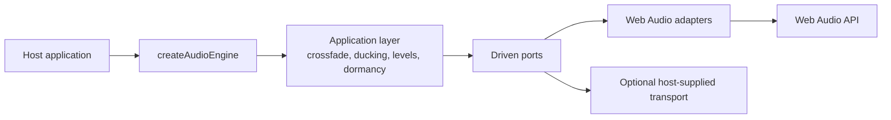

# Obsidian Eclipse Audio Engine

Open-source runtime package for application and game audio on the web, Android and iOS.

It is the sibling of the
[Obsidian Eclipse Graphic Engine](https://github.com/stefanodp91/obsidian-eclipse-graphic-engine)
and is split along the same line: **the library owns the machinery, the host owns the content.**

| The library owns | The host owns |
| --- | --- |
| The audio graph, its buses and a safety limiter | The sound files, and whatever produces them |
| Unlocking audio: the first gesture, and autostart where the platform allows it | Which track belongs to which moment |
| One transport contract, with the same behavior on every platform | When to duck, and by how much |
| Gapless looping, crossfade, ducking and bus levels as primitives | The shape of a cue: steps, proximity, intensity |
| Buffer lifetime, and the hardware session across the application lifecycle | |

## Sample

`samples/audio-bench` exercises every part of the engine a host would use — autostart, crossfade,
ducking, levels, cues, muting and the lifecycle — and reports what the platform is actually doing
while it does. That second half is the point: the defects this package was built around were
invisible in code and obvious in the platform's own diagnostics.

```bash
npm install
npm run dev
```

Its three sounds are generated from numbers rather than committed as binaries nobody has the source
for. See the [sample guide](samples/audio-bench/README.md) to regenerate them.

## Architecture



The driven `MusicTransport` port is deliberately the *intersection* of what every transport can do,
not the union: crossfade, ducking and bus levels are built above it, once, out of volume ramps. A
capability implemented inside one transport becomes a control that exists on a single platform, and
nobody finds out until someone profiles the other one.

Music is decoded once and read from a buffer in a circle on every platform, including inside a
Capacitor WebView. That is a measured decision with a stated cost, not a default:
[music playback](packages/core/wiki/music-playback.md) records the three independent ways a platform
media player fails a track that loops for minutes, the three hypotheses that fell on the way, and
what the choice costs in CPU and memory.

```text
packages/core/        the engine: ports, application layer, Web Audio adapters
samples/audio-bench/  the reference sample, which is also the instrument
docs/adr/             architecture decisions
```

## Get started

```bash
npm install
npm run check
```

Package documentation:

- [`obsidian-eclipse-audio-engine`](packages/core/README.md)
- [Core architecture and guides](packages/core/wiki/index.md)
- [Audio-bench sample](samples/audio-bench/README.md)

Two requirements a host must meet before it ships — the bitrate of its music files and the headroom
it leaves for the limiter — are stated with their measurements in
[audio assets](packages/core/wiki/audio-assets.md).

## Credits

The engine has no runtime dependency: it speaks the Web Audio API, which the platform provides. See
[Credits and third-party software](THIRD_PARTY_NOTICES.md) for the development toolchain and license
information.

## Releases

GitHub Releases are generated automatically from semantic-version tags. Each release contains the
package tarball, the built sample and SHA-256 checksums. See the [`CHANGELOG.md`](CHANGELOG.md) for
notable changes and [`docs/RELEASING.md`](docs/RELEASING.md) for the release procedure.

## License

MIT © Obsidian Eclipse contributors.
