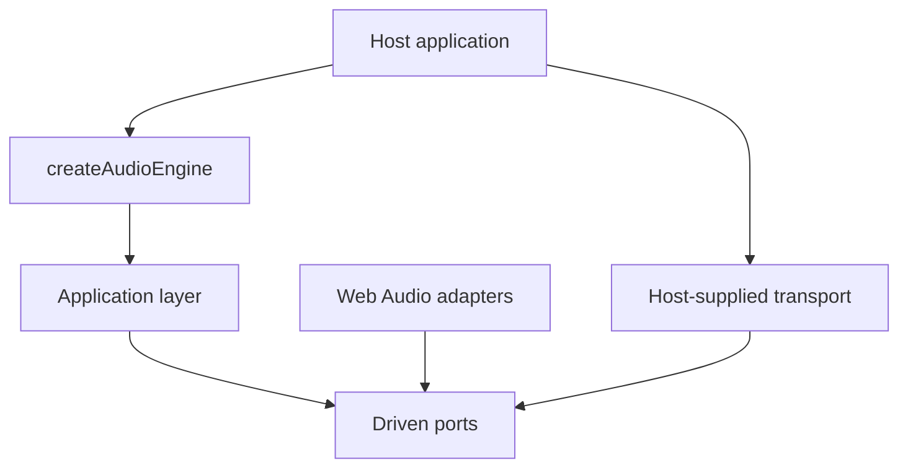

# ADR 0001: Standalone audio package with an injectable transport

**Status:** accepted
**Date:** 2026-09-08

## Context

Application audio is usually written inside the application that needs it, and it stays correct only
on the platform its author profiles. The behaviors that matter — unlocking, gapless looping,
crossfade, ducking, releasing the hardware when nothing can be heard — are mechanisms, not content,
and every host reimplements them.

The failure this package is built to prevent is specific: when music runs on one mechanism in the
browser and a different one on the device, a host does not have one behavior with two
implementations. It has two behaviors, and only one of them is under test. Controls written against
the richer mechanism silently stop existing on the other platform.

## Decision

Maintain one public repository with a single installable package and a reference sample:

- `packages/core` builds the ESM package `obsidian-eclipse-audio-engine`, with no runtime and no
  peer dependency;
- the driven `MusicTransport` port is the intersection of what every transport can do, with the one
  refinement that an operation belongs to it when every transport performs it better than a caller
  driving it from outside — which is why `fade` is a transport operation and crossfade is not;
- everything richer — crossfade, ducking, bus levels, the dormant state — is built once in the
  application layer out of volume ramps;
- Web Audio adapters are the default and ship on the root entry point, because there is one adapter
  family and it carries no optional heavyweight peer;
- a host with different requirements injects its own transport through the `musicTransport` option
  rather than forking the package;
- `samples/audio-bench` is a brand-agnostic reference sample that is also the diagnostic instrument;
- GitHub Releases package verified artifacts without requiring npm publication.

## Consequences

- A host installs build output instead of compiling internal source paths.
- A control added to the application layer behaves identically on every platform by construction; a
  control added to one adapter cannot reach the public surface.
- The package can be adopted by a host that already owns its audio files and its policy, because it
  claims neither.
- A host that needs platform media features must implement the driven port and accept its stated
  rules, rather than receive a divergent behavior by default.
- The sample carries the diagnostic burden: a defect that is invisible in code has somewhere to be
  reproduced.

## Alternatives rejected

### Keep the audio code inside the consuming application

Rejected because the mechanisms are not application-specific, and because the defects they prevent
are found only when one implementation is shared across platforms.

### Publish per-platform packages with per-platform surfaces

Rejected because it institutionalizes the very divergence this package exists to remove: each
surface would grow the controls its platform makes easy.

### Take the union of transport capabilities as the port

Rejected because the union is only implementable by the richest transport. Every other
implementation would have to fake capabilities or refuse them at runtime, which moves the divergence
from the API into the behavior, where it is harder to see.
