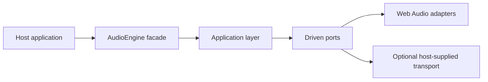

# obsidian-eclipse-audio-engine

An ESM runtime package for application and game audio. It provides a small facade for unlocking,
music, cues, bus levels and the audio hardware lifecycle, with Web Audio adapters and an injection
point for a host-supplied transport.

The package follows a ports-and-adapters design: everything that must behave identically on every
platform is built once in the application layer, out of the one control every transport has.



## Requirements

- Node.js 22 or newer for development
- A runtime with the Web Audio API: a browser, or a Capacitor WebView on Android and iOS

There is no runtime dependency and no peer dependency.

## Install

```bash
npm install obsidian-eclipse-audio-engine
```

## Public API

| Export | Purpose |
| --- | --- |
| `createAudioEngine(options)` | Builds an engine on Web Audio with one call |
| `AudioEngine`, `MusicController`, `CueController`, `AudioStatus` | The driving port: the surface a host talks to |
| `MusicTransport`, `CueTransport`, `MutePreference`, `AudioErrorSink` | The driven ports a host may implement |
| `WebAudioGraph`, `WebAudioMusicTransport`, `WebAudioCueTransport` | The default adapters, exported so a custom transport can share the graph |
| `localStorageMutePreference`, `inMemoryMutePreference` | Two ready implementations of the mute preference |
| `DefaultAudioEngine` | The application service, for a host that assembles its own dependencies |

## Basic usage

```ts
import { createAudioEngine } from 'obsidian-eclipse-audio-engine';

const audio = createAudioEngine({
  onError: (error, context) => telemetry.record(error, context),
});

// Boot: try without a gesture, and keep the gesture as the fallback.
if (!(await audio.tryAutoStart())) {
  window.addEventListener('pointerdown', () => audio.unlock(), { once: true, capture: true });
}

await audio.music.play('menu', 'audio/bgm/menu.m4a');
await audio.cues.warm([{ id: 'click', path: 'audio/sfx/click.flac' }]);
audio.cues.play('click');
```

Playing a second track crossfades by default; pass `crossfadeMs: 0` for a hard cut. `music.duck()`
pulls the music down under an important cue and lets it back up, and it works on every transport
because it is volume rather than filtering.

On a Capacitor host nothing changes: the same graph runs inside the WebView. That is a measured
decision — see [music playback](wiki/music-playback.md).

## Design boundary

- The application layer owns everything that must be identical on every platform.
- The driven ports name no platform type; the Web Audio adapters implement them.
- A host-supplied transport is injected through a port, never selected by a branch inside the
  engine.

Prefer the declared package exports; avoid deep imports into `src/`, which is not public API.

Read the [core engine documentation](wiki/index.md) for architecture, lifecycle, music playback and
audio asset guides.

## License

MIT © Obsidian Eclipse contributors.
