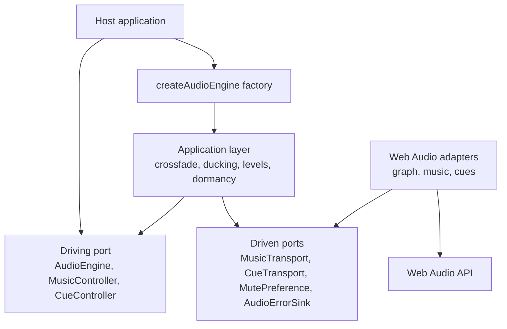

# Architecture

The engine uses a ports-and-adapters design. The driving port is the whole surface a host talks to;
the driven ports are what the engine needs from the outside world. Between them sits an application
layer that owns every behavior which must be identical on every platform.

## Layers



The dependency rule points inward. Ports name no platform type; adapters may import the ports, never
the reverse. The application layer imports both and neither imports the host.

## The driven port is an intersection, not a union

`MusicTransport` exposes what every transport can do — preload, play, stop, set volume, fade,
release — and nothing more. Crossfade, ducking and bus levels are built above it, once, out of
volume ramps.

The rule that produced this shape: a host whose music runs on one mechanism in the browser and a
different one on the device does not have one behavior with two implementations, it has two
behaviors, and only one of them is ever under test. Controls written against the richer mechanism
quietly stop existing on the platform nobody profiles.

There is one refinement, and it was paid for by measurement. `fade` belongs to the intersection even
though a caller could emulate it with repeated volume writes, because every transport performs a
ramp better than the code driving it from outside: each write is an instantaneous gain step on a
signal that is sounding, and twenty steps across eight hundred milliseconds are audible as
scratches. The rule that follows is stated once here: **the intersection is not the set of the
smallest commands, it is the set of the things every transport does better than its caller.**

## Public surface

| Import | Responsibility | Runtime dependency |
| --- | --- | --- |
| `obsidian-eclipse-audio-engine` | Ports, adapters and `createAudioEngine()` | none |

The package has no runtime dependency at all: it speaks the Web Audio API, which the platform
provides. There is a single adapter family and it is the default one, so — unlike a package that
carries optional heavyweight peers — the adapters stay on the root entry point rather than behind
subpath exports. A host that brings its own music transport injects it through the `musicTransport`
option and needs no other entry point.

## What lives where

```text
packages/core/src/api/           the factory, the default asset fetch, host-facing options
packages/core/src/application/   behavior that must be identical on every transport
packages/core/src/ports/driving/ the surface a host talks to
packages/core/src/ports/driven/  what the engine asks of the outside world
packages/core/src/adapters/      Web Audio graph, music and cue transports, mute preference
```

## Deliberate absences

There is no notion of a world, a level, a screen or a result in the driving port, and no list of
tracks. Which sound plays when is the host's story. A library that encoded it would need a fork for
the next host, and the fork would be where the platform defects came back.
