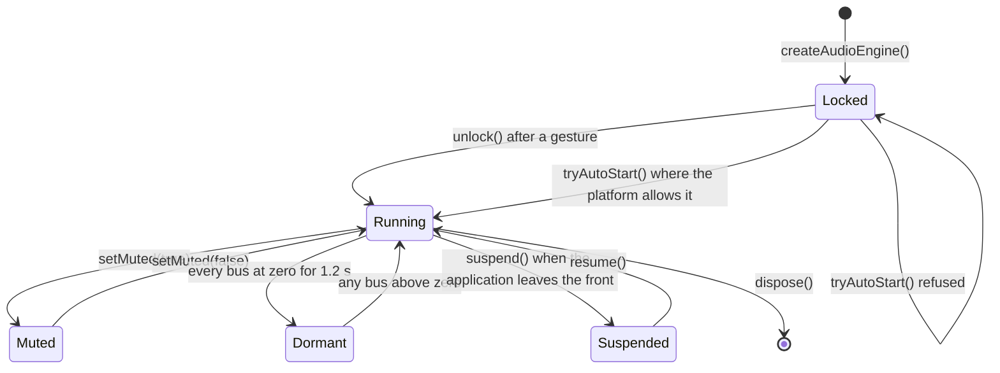

# Engine lifecycle

The engine owns the audio hardware session. A host drives it with five calls — `unlock`,
`tryAutoStart`, `setMuted`, `suspend`, `resume` — and disposes it once.

## Starting

Two entry points exist because two platform policies exist, and a host that knows only the first
ships an application that boots silent on a phone without anyone noticing.

- `unlock()` is for a user gesture. It is idempotent and cheap after the first call, so a host can
  wire it to every handler it owns without reasoning about which one fires first.
- `tryAutoStart()` attempts to start with no gesture at all and returns whether it worked. Browsers
  refuse; a Capacitor WebView allows it, because Capacitor turns the gesture requirement off. It
  returns a boolean instead of throwing so that the gesture path stays a fallback rather than a
  workaround.

The boot sequence a host should copy is: try `tryAutoStart()`, and if it returns false, register a
one-shot gesture handler that calls `unlock()`. On a refusal the graph stays locked and does not
pretend otherwise, but the suspended context is kept: a later gesture then finds it already built
instead of building it while the finger is still down.

## Muting and the dormant state

These are two different states and only the second one returns power.

- **Muted** is a listener's choice. It is persisted through the `MutePreference` port, and it
  suspends the hardware rather than only zeroing a gain.
- **Dormant** is a consequence of the levels: when both bus levels reach zero, there is nothing to
  hear, and after 1.2 s the context is suspended. Waking is immediate; sleeping is deferred, because
  a level that crosses zero while a slider is dragged must not suspend and reopen the context — that
  traffic is audible. `status()` distinguishes the two, so a host can report "not muted, and not
  audible either".

The reason the library does this rather than leaving it to the host: an open audio session draws
current at any volume — about 1.25 mAh per minute of session on Android — so "every level at zero"
and "audio off" are different states, and a host that does not know it ships an application that is
correctly silent and drains the battery anyway. Nobody reports that defect, because there is nothing
to hear and nothing to see.

## Following the application

`suspend()` and `resume()` follow the host application's lifecycle: they release and reacquire the
hardware when the application leaves and returns to the front. A resume refused outside a gesture is
not treated as an error.

`dispose()` releases every decoded buffer, stops pending ramps, and closes the context. Ramps in
flight are invalidated by generation rather than cancelled individually, so a fade whose track was
replaced mid-flight stops writing volumes for a track nobody is listening to.

## Error reporting

Every failure inside a transport is reported through the `AudioErrorSink` passed to
`createAudioEngine`, never swallowed in a bare `catch`. The default sink does nothing, and a host
that leaves it that way has chosen not to know: an audio defect that only makes the application
quieter is exactly the kind that ships.
