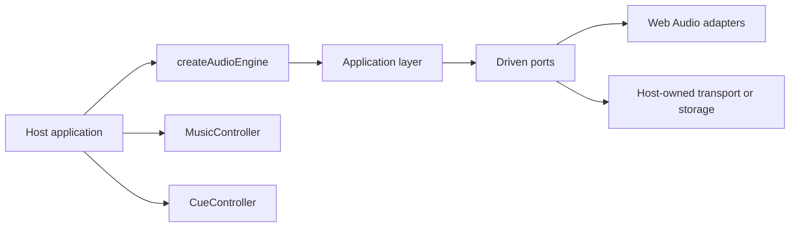

# Core engine documentation

This documentation describes the standalone `obsidian-eclipse-audio-engine` package as it exists in
this repository. It contains no migration log, product history, or assumptions about a specific host
application.

## Start here

- [Architecture](architecture.md) explains the ports-and-adapters layering and the dependency
  direction.
- [Engine lifecycle](engine-lifecycle.md) covers unlocking, autostart, muting, the dormant state,
  suspension and disposal.
- [Music playback](music-playback.md) records why music is decoded once and read from a buffer
  instead of being handed to a platform media player, and what that costs.
- [Audio assets](audio-assets.md) states the encoding requirements a host must meet, each with the
  measurement behind it.

## Documentation boundary

The package owns the machinery: the graph, its buses, the safety limiter, unlocking, looping,
crossfade, ducking, bus levels and the audio hardware lifecycle. A host owns the content and every
policy about it: which file exists, which sound belongs to which moment, how loud a mix should be,
and when to duck.

That boundary is not a preference. A library that knew which track belongs to a menu would have to
be forked for the next host, and a control implemented inside one transport would silently stop
existing on the platform nobody profiles.

Only the exports declared in [`packages/core/package.json`](../package.json) are public API. Paths
under `src/` are implementation details.
